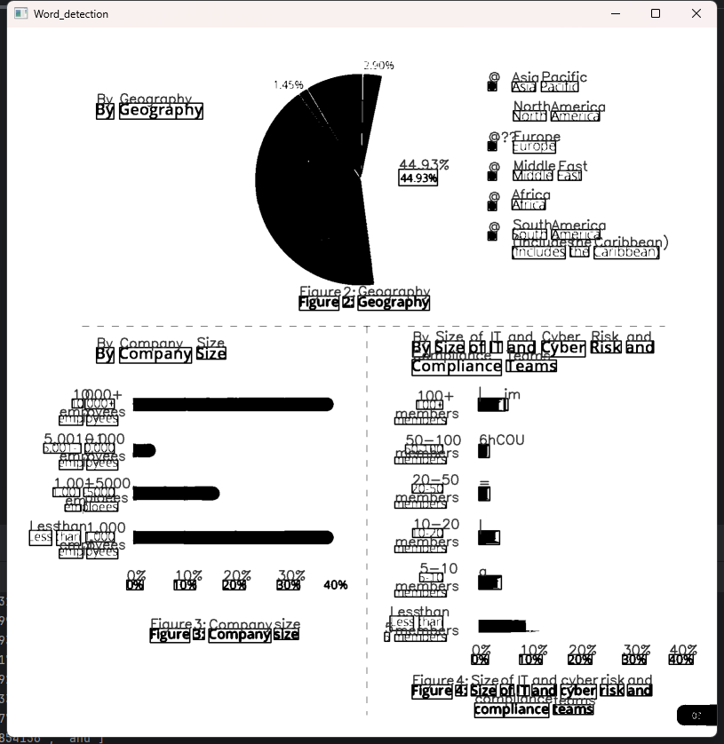

# Exploring Image Processing and Text Detection with Python 
## Introduction:
"text detection.py" evaluates a Python-based text detection system that employs the EAST detection algorithm and Tesseract-OCR for character and word recognition.Meanwhile allowing users to choose the text detection method and apply various preprocessing methods such as noise removal, dilation, erosion, and deskew correction to enhance text recognition accuracy.The primary goal is to offer a user-friendly tool that can effectively detect text regions in images and recognize individual characters or words, with options to visualize the results directly on the images or output them for further use.

## Technologies Used

    1.OpenCV: For image processing tasks such as grayscale conversion, thresholding, and contour detection. 
    2.PaddleOCR: A deep learning-based OCR tool used to recognize and extract text from images.
    3.NumPy: For handling arrays and image data.
    4.Tesseract-OCR:An open-source OCR engine used for recognizing text in images.

## Installation

1.Install Python and Dependencies: Ensure Python 3.x is installed on your machine. Install the required dependencies using pip:
    
    pip install opencv-python-headless numpy paddlepaddle paddleocr pillow

2.Install tesseract

    https://digi.bib.uni-mannheim.de/tesseract/

## Original Pictrues

  

## Results

